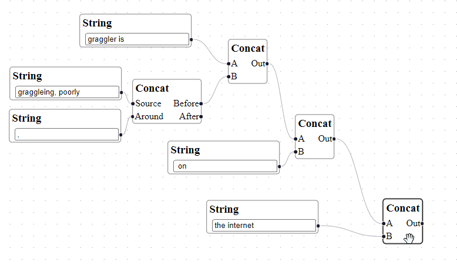
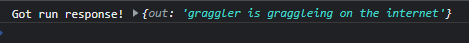

# Learn Reactflow

This is a proof of concept use of the [React Flow](https://reactflow.dev/) library to make an Unreal-engine style blueprint flowchart system with a Golang server that can execute flowcharts sent to it.

This essentially mirrors [Flume](https://flume.dev/)'s functionality - but compared to React Flow, Flume is a much less mature library, and development appears to have slowed down significantly. It's also not type safe.

---

Run the client with

```
yarn dev
```

Run the server with

```
cd ./server
go run .
```

Create a flowchart, then select a node and click _Run!_, then check the output in the console.



